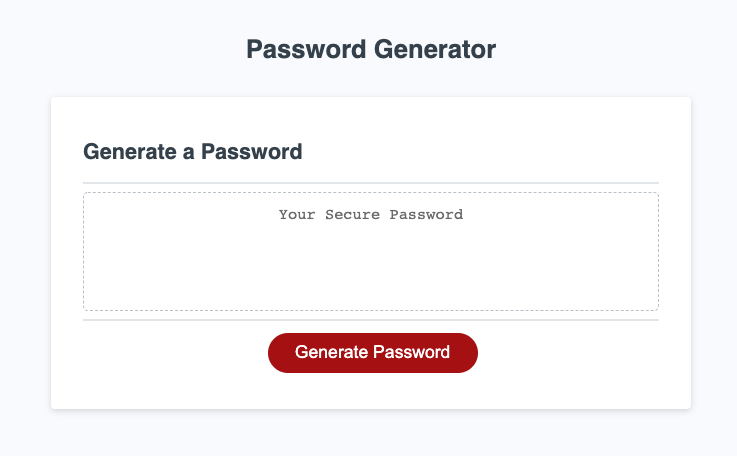

# Password Generator
Lesson 3 Weekly Challenge | JavaScript

## Student Name
Tara Brichetto

## Creation Date
16 August 2020

## Purpose
This password generator was created as the Week 3 Challenge Assignment for the University of Arizona's coding bootcamp program. The application allows a user to randomly generate a password that meets certain criteria.

## Project Requirements
*User can generate a password by clicking a button  
*User is prompted for password criteria (length, character types)  
*User inputs are validated  
*A password is generated once all prompts are answered  

## Languages
*HTML  
*CSS  
*JavaScript  

## Links
Github Repository | https://github.com/tbrichet/password-generator  
Deployed Application | https://tbrichet.github.io/password-generator

## Contribution
* The starter code was provided by the University of Arizona team.  
* The updates to the JavaScript file were made with <3 by Tara Brichetto.  

## Screenshot

